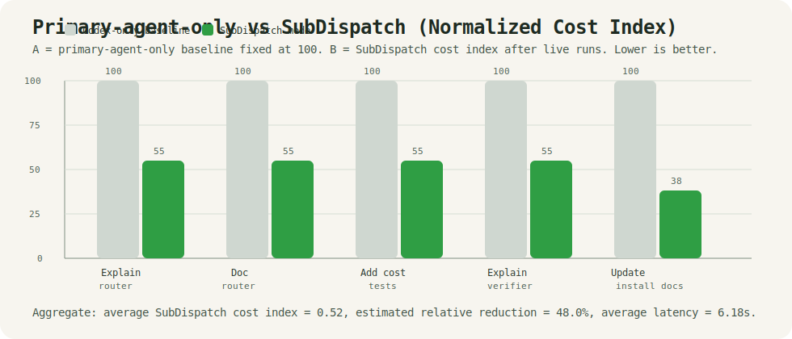

# 💸 CodexSaver

> Cut your Codex cost by 40–70% — without sacrificing quality.


---

## What is CodexSaver?

CodexSaver turns Codex into a cost-aware router.
Low-risk coding work goes to DeepSeek API.
High-value reasoning and final approval stay in Codex.

- 🧠 Codex → reasoning, architecture, validation
- ⚡ DeepSeek → execution, search, boilerplate, tests

---

## Demo

```
Input:
"Add unit tests for user service"

[Codex] Low-risk test generation task detected
[Codex] Calling codexsaver.delegate_task

[CodexSaver] route=deepseek
[Router] task_type=write_tests risk=low
[DeepSeek] Generated patch
[Verifier] Structural verification passed
[Saved] Estimated Codex saving: 62%

[Codex] Reviewing patch
[Codex] Approved after verification
```

---

## Cost Comparison

```
Task: "Add tests + fix lint"

Before:
  Codex only: $0.52

After:
  CodexSaver: $0.18

Saved: 65%
```

Current estimator bands in code:

| Delegated context size | Estimated savings |
|---|---:|
| `< 8k` chars | `45%` |
| `8k–50k` chars | `62%` |
| `> 50k` chars | `70%` |

These percentages are heuristic outputs from the current `CostEstimator`, not live
billing data from Codex or DeepSeek. They are useful for routing comparisons and README
demos, but not yet for finance-grade reporting.

---

## Architecture

```
User
  ↓
Codex
  ↓ MCP tool call
CodexSaver
  ├─ Router
  ├─ Context Packer
  ├─ DeepSeek API Worker
  ├─ Verifier
  └─ Cost Estimator
  ↓
Codex review / apply / finalize
```

---

## Install

### Manual Install

```bash
git clone https://github.com/yourname/codexsaver
cd codexsaver

python cli.py auth set --api-key YOUR_DEEPSEEK_API_KEY
python cli.py install --project
python cli.py doctor
```

If you prefer one-shell-session auth without saving it locally:

```bash
export DEEPSEEK_API_KEY=xxx
python cli.py install --project
python cli.py doctor
```

If you also want CodexSaver available outside this repo:

```bash
python cli.py auth set --api-key YOUR_DEEPSEEK_API_KEY
python cli.py install --global
python cli.py doctor
```

### One Message To Codex

If Codex is already open in this repository, you can ask it to do the setup for you:

```text
Save my DeepSeek API key for CodexSaver, run `python cli.py auth set --api-key ...`, then run `python cli.py install --project` and `python cli.py doctor`, and tell me whether it is ready.
```

If you want project-level plus global setup in one go:

```text
Save my DeepSeek API key for CodexSaver, install CodexSaver for this repo and globally, run `python cli.py auth set --api-key ...`, `python cli.py install --project`, `python cli.py install --global`, then `python cli.py doctor`, and summarize the result.
```

Ready means:

- `.codex/config.toml` exists in this repo
- `codexsaver_mcp.py` exists
- `python cli.py doctor` reports the workspace is ready
- a DeepSeek API key is available from either `DEEPSEEK_API_KEY` or local CodexSaver config

---

## Use with Codex

Project config (`.codex/config.toml`):

```toml
[mcp_servers.codexsaver]
command = "python"
args = ["./codexsaver_mcp.py"]
startup_timeout_sec = 10
tool_timeout_sec = 120
```

Global Codex config (`~/.codex/config.toml`) also works:

```toml
[mcp_servers.codexsaver]
command = "python"
args = ["./codexsaver_mcp.py"]
startup_timeout_sec = 10
tool_timeout_sec = 120
```

If you want to use it from outside the repo directory, point `args` at the cloned
project path on your own machine:

```toml
[mcp_servers.codexsaver]
command = "python"
args = ["/absolute/path/to/codexsaver/codexsaver_mcp.py"]
startup_timeout_sec = 10
tool_timeout_sec = 120
```

Verified on May 7, 2026:

```json
{"jsonrpc":"2.0","id":1,"result":{"protocolVersion":"2024-11-05","capabilities":{"tools":{}},"serverInfo":{"name":"codexsaver","version":"0.2.0"}}}
{"jsonrpc":"2.0","id":2,"result":{"tools":[{"name":"delegate_task"}]}}
```

Then tell Codex:

```
Use CodexSaver for safe low-risk tasks.
Add unit tests for user service.
```

### What You Will See In Tool Responses

CodexSaver now returns an `interaction` block so the tool feels visible during use,
instead of looking like a silent JSON router:

```json
{
  "interaction": {
    "tool": "codexsaver.delegate_task",
    "mode": "delegated_execution",
    "headline": "CodexSaver delegated this task to DeepSeek.",
    "route_label": "[CodexSaver] route=deepseek task_type=write_tests risk=low",
    "next_step": "Review the worker result and apply it only if the patch looks safe."
  }
}
```

This makes three states obvious at a glance:

- `preview`: routing preview only, no external call made
- `delegated_execution`: delegated run completed
- `codex_takeover`: CodexSaver decided Codex should handle it

---

## CLI Test

Dry run:

```bash
python cli.py "add unit tests for user service" --files src/user/service.ts --workspace . --dry-run
```

Real call:

```bash
python cli.py "add unit tests for user service" --files src/user/service.ts --workspace .
```

Explicit setup commands:

```bash
python cli.py auth set --api-key YOUR_DEEPSEEK_API_KEY
python cli.py install --project
python cli.py install --global
python cli.py doctor
```

CodexSaver resolves relative file paths from `workspace` and executes worker-proposed
`commands_to_run` during verification. If any verification command fails, the task falls
back to Codex with `needs_codex`.

### Verified End-to-End Results

Measured on May 7, 2026 with the new local-key flow:

| Check | Command | Result |
|---|---|---|
| Full test suite | `pytest -q` | `71 passed in 0.31s` |
| Project install | `python cli.py install --project --workspace .` | `status=ok`, project config already correct |
| Local key persistence | `python cli.py auth set --api-key ...` | saved to `~/.codexsaver/config.json` |
| Workspace doctor | `python cli.py doctor --workspace .` | `deepseek_api_key_source=local_config`, workspace ready |
| Real delegated call | `python cli.py delegate "Explain the routing logic briefly" --files codexsaver/router.py --workspace .` | `route=deepseek`, `status=success`, verification passed |

This verifies the new intended workflow:

1. Save the key once with `python cli.py auth set --api-key ...`
2. Install CodexSaver into the workspace with `python cli.py install --project`
3. Confirm readiness with `python cli.py doctor`
4. Make real delegated calls without re-exporting `DEEPSEEK_API_KEY`

---

## Five-Task A/B Benchmark

Method:

- **A** = counterfactual `Codex-only` baseline, normalized cost index fixed at `1.00`
- **B** = `CodexSaver` mode with real task execution through the current router and DeepSeek worker
- latency is measured wall-clock time for the live CodexSaver run
- savings are the current `CostEstimator` outputs, so this is a reproducible routing benchmark, not invoice-grade billing data

Summary:

- All 5 tasks are typical low-risk development chores: explanation, docs, tests, and README maintenance.
- All 5 tasks delegated successfully after using natural low-risk phrasing.
- Average live latency was `6.18s`.
- Average estimated savings were `48.4%`.
- In normalized terms, the average cost index moved from `1.00` to `0.52`, which is a `48.0%` relative reduction.
- The slowest task was the README update because it carried the largest context and patch payload.

| Task | Type | Route | Latency | A: Codex-only Cost Index | B: CodexSaver Cost Index | Estimated Savings | Output Shape |
|---|---|---|---:|---:|---:|---:|---|
| Explain router logic | `explain` | `deepseek` | `2.13s` | `1.00` | `0.55` | `45%` | read-only summary |
| Document router module | `docs` | `deepseek` | `3.13s` | `1.00` | `0.55` | `45%` | 1-file patch |
| Add cost tests | `write_tests` | `deepseek` | `9.29s` | `1.00` | `0.55` | `45%` | test patch |
| Explain verifier flow | `explain` | `deepseek` | `2.30s` | `1.00` | `0.55` | `45%` | read-only summary |
| Update install docs | `docs` | `deepseek` | `14.06s` | `1.00` | `0.38` | `62%` | README patch |



Figure: normalized cost index by task. Every gray bar is the `Codex-only` baseline fixed at `100`.
Green bars show the `CodexSaver` cost index for the same task. Lower bars indicate lower estimated
Codex spend under the current routing model.

Interpretation:

- Read-only explain tasks were the fastest and most predictable wins.
- Small docs edits still delegated well and returned compact, reviewable patches.
- Test generation had higher latency than explain/docs, but still remained in the low-risk savings band.
- Larger-context documentation work produced the biggest estimated savings because the counterfactual
  `Codex-only` context cost would be higher.

Note on prompt wording:

- During calibration, a test task containing the phrase `production logic` was routed back to Codex
  because `production` is intentionally treated as a high-risk keyword.
- The benchmark table above uses the corrected natural phrasing that better matches a true low-risk
  test-writing task.

---

## Verified Routing Contrast

Low-risk task on May 7, 2026:

```bash
python cli.py "add unit tests for user service" --files cli.py --workspace . --dry-run
```

```json
{
  "route": "deepseek",
  "status": "dry_run",
  "decision": {
    "task_type": "write_tests",
    "risk": "low"
  },
  "estimated_savings_percent": 45
}
```

High-risk task on May 7, 2026:

```bash
python cli.py "fix security vulnerability in auth flow" --files codexsaver/router.py --workspace . --dry-run
```

```json
{
  "route": "codex",
  "status": "needs_codex",
  "decision": {
    "risk": "high",
    "protected_hits": ["security"]
  },
  "estimated_savings_percent": 0
}
```

This is the intended split:

- Low-risk execution gets delegated.
- High-risk/security-sensitive work stays in Codex.

### Quantified Routing Samples

Measured with `python cli.py ... --dry-run` on May 7, 2026:

| Task | Task Type | Risk | Route | Estimated Savings |
|---|---|---|---|---:|
| `Add unit tests for user service` | `write_tests` | `low` | `deepseek` | `45%` |
| `Explain the routing logic` | `explain` | `low` | `deepseek` | `45%` |
| `Update README usage docs` | `docs` | `low` | `deepseek` | `45%` |
| `Explain auth code` | `explain` | `medium` | `deepseek` | `45%` |
| `Add tests across six files` | `write_tests` | `medium` | `deepseek` | `45%` |
| `Refactor auth service` | `simple_refactor` | `high` | `codex` | `0%` |
| `Fix security vulnerability in auth flow` | `unknown` | `high` | `codex` | `0%` |
| `Design new authentication architecture` | `unknown` | `high` | `codex` | `0%` |

In this sample set:

- `5 / 8` tasks were delegated.
- `3 / 8` tasks were kept in Codex.
- All `high` risk tasks stayed in Codex.
- `medium` risk read-only work still delegated.

### Live API Report

Measured with real DeepSeek-backed invocations on May 7, 2026:

| Case | Task | Route | Status | Latency | Changed Files | Patch Size | Response Size | Estimated Savings |
|---|---|---|---|---:|---:|---:|---:|---:|
| Read-only analysis | `Explain the routing logic and summarize protected path handling` | `deepseek` | `success` | `1.55s` | `0` | `0 chars` | `778 chars` | `45%` |
| Small docs edit | `Add concise module-level documentation to router.py without changing behavior` | `deepseek` | `success` | `3.22s` | `1` | `277 chars` | `1108 chars` | `45%` |

Observed from these live calls:

- CodexSaver completed a read-only delegated task in `1.55s`.
- CodexSaver completed a small patch-producing delegated task in `3.22s`.
- The patch-producing call returned a compact `277` character diff for one file.
- Both calls passed verification, but neither suggested follow-up commands.

This gives a practical split for README claims:

- `dry_run` demonstrates routing policy.
- real API calls demonstrate actual delegated execution.
- protected/high-risk tasks can still be shown locally without making unnecessary outbound calls.

### Routing Logic Analysis

CodexSaver does not ask "is this coding work?" first. It asks a stricter question:
"is this coding work cheap enough to delegate without losing judgment quality?"

That logic currently has four layers:

1. **Task classification**
   Low-risk categories such as `write_tests`, `docs`, `code_search`, `explain`,
   `fix_lint`, `boilerplate`, and `simple_refactor` are eligible for delegation.

2. **Instruction risk scan**
   Keywords like `security`, `authentication`, `billing`, `migration`, `deploy`,
   `encrypt`, and `token` immediately raise risk because they usually require more than
   syntax-level correctness.

3. **Path/domain risk scan**
   File paths containing domains such as `auth`, `payments`, `billing`, `infra`,
   `migrations`, `.github/workflows`, or secrets-related terms are treated as protected.
   That blocks or limits delegation even when the task wording looks harmless.

4. **Safe exceptions for read-only work**
   Some `medium` risk tasks still delegate when they are mostly observational:
   `explain`, `docs`, `code_search`, and `write_tests`. This is why
   `Explain auth code` can still route to DeepSeek while `Refactor auth service` stays
   in Codex.

This produces a deliberate asymmetry:

- Read-only understanding can be cheap.
- Write access to sensitive domains is expensive in risk, even if the code change is small.
- Ambiguity defaults to Codex, not to delegation.

---

## Task Routing

### Delegated to DeepSeek

- repo scanning and code search
- code explanation and summarization
- writing unit tests
- fixing lint/type errors
- documentation updates
- boilerplate generation
- small, localized refactors

### Kept in Codex

- architecture decisions
- auth/security/payment logic
- database migrations
- permissions or access-control changes
- production deployment logic
- ambiguous requirements
- final review before applying changes

---

## Roadmap

- [x] MCP server (`codexsaver.delegate_task`)
- [x] Rule-based router
- [x] DeepSeek API integration
- [x] Context packing
- [ ] Cost-aware routing
- [ ] Multi-model support

---

## If this saves you money

Give it a star ⭐
