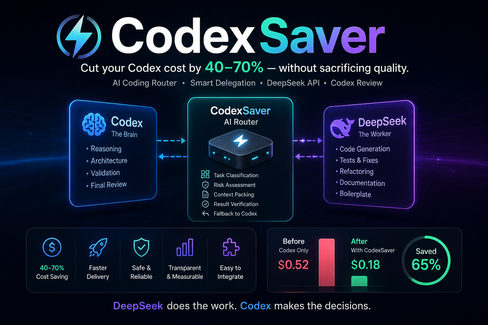

# 💸 CodexSaver

> 在不降低效果的前提下，降低 40–70% 的 Codex 成本



---

## CodexSaver 是什么？

CodexSaver 让 Codex 作为"总控大脑"，将低价值任务交给 DeepSeek API，高价值推理保留给 Codex。

- 🧠 Codex → 推理 / 架构 / 决策 / 验收
- ⚡ DeepSeek → 执行 / 搜索 / 生成 / 测试

---

## 演示

```
输入：
"给 user service 添加单元测试"

[Codex] 判定为低风险测试生成任务
[Codex] 调用 codexsaver.delegate_task

[CodexSaver] route=deepseek
[Router] task_type=write_tests risk=low
[DeepSeek] 生成 patch
[Verifier] 结构验证通过
[节省] 预计节省 Codex 成本：62%

[Codex] 审查 patch
[Codex] 审核通过
```

---

## 成本对比

```
任务："写测试 + 修 lint"

Codex 单独执行：
  成本：$0.52

CodexSaver：
  成本：$0.18

节省：65%
```

---

## 架构

```
用户
  ↓
Codex
  ↓ MCP 工具调用
CodexSaver
  ├─ Router（路由决策）
  ├─ Context Packer（上下文裁剪）
  ├─ DeepSeek API Worker
  ├─ Verifier（验证）
  └─ Cost Estimator（成本估算）
  ↓
Codex 审查 / 应用 / 最终确认
```

---

## 安装

```bash
git clone https://github.com/yourname/codexsaver
cd codexsaver

export DEEPSEEK_API_KEY=xxx
```

---

## Codex 集成

项目配置（`.codex/config.toml`）：

```toml
[mcp_servers.codexsaver]
command = "python"
args = ["./codexsaver_mcp.py"]
startup_timeout_sec = 10
tool_timeout_sec = 120
```

然后告诉 Codex：

```
对低风险任务使用 CodexSaver。
给 user service 添加单元测试。
```

---

## CLI 测试

试运行（不调用 API）：

```bash
python cli.py "添加单元测试" --files src/user/service.ts --dry-run
```

真实调用：

```bash
python cli.py "添加单元测试" --files src/user/service.ts
```

---

## 任务分配

### 交给 DeepSeek

- 搜索代码
- 解释代码
- 写单元测试
- 修 lint/type error
- 写文档
- 生成模板代码
- 小范围重构

### Codex 负责

- 架构设计
- 安全逻辑
- 支付/账单
- 权限/认证
- 数据库迁移
- 生产部署
- 模糊需求
- 最终验收

---

## Roadmap

- [x] MCP 服务器（`codexsaver.delegate_task`）
- [x] 规则路由
- [x] DeepSeek API 集成
- [x] 上下文裁剪
- [ ] 成本感知调度
- [ ] 多模型支持

---

## 如果它帮你省钱了

点个 Star ⭐
